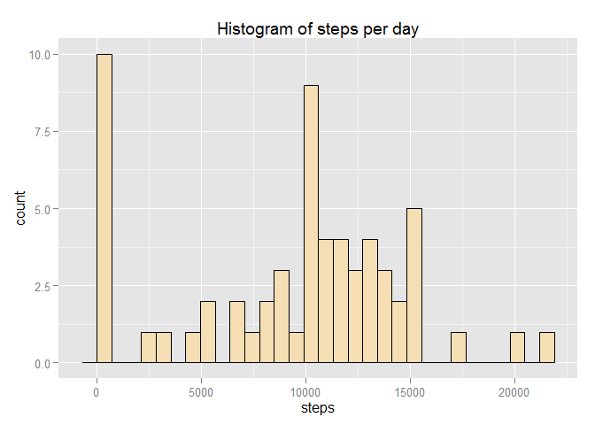
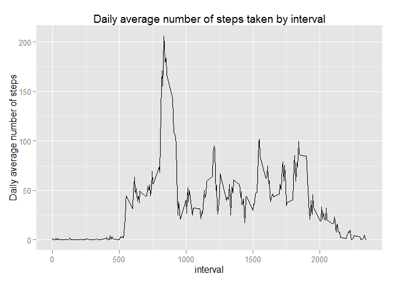

# Reproducible Research: Peer Assessment 1


## Loading and preprocessing the data


```r
unzip("activity.zip")
activity <- read.csv("activity.csv")
```


## What is mean total number of steps taken per day?

### Summarize by date

Group the data by date and compute the sum of steps taken per day. For this computation, NAs were removed. 
Column `interval` is not relevant for this summary, so we use the special `summarise_each_()` function to exclude it.


```r
library(dplyr)
```

```
## Warning: package 'dplyr' was built under R version 3.2.2
```

```
## 
## Attaching package: 'dplyr'
## 
## The following objects are masked from 'package:stats':
## 
##     filter, lag
## 
## The following objects are masked from 'package:base':
## 
##     intersect, setdiff, setequal, union
```

```r
groupByDay <- group_by(activity, date) 
stepsPerDay <- 
    summarise_each_(groupByDay, 
                    funs(sum(., na.rm = TRUE)), 
                    list(quote(-interval)))
```


### Histogram of steps per day


```r
library(ggplot2)
```

```
## Warning: package 'ggplot2' was built under R version 3.2.2
```

```r
qplot(steps, data = stepsPerDay,
      main = "Histogram of steps per day",
      fill = I("wheat"),
      col = I("black"))
```

```
## stat_bin: binwidth defaulted to range/30. Use 'binwidth = x' to adjust this.
```

 


### Mean and median of steps per day


```r
meanStepsPerDay <- mean(stepsPerDay$steps)
medianStepsPerDay <- median(stepsPerDay$steps)
```

Of the total number of steps taken per day, the mean is 9354.2295082 and the median is 10395.


## What is the average daily activity pattern?

### Compute the average by interval

Group the data by interval and compute the mean of steps. For this computation, NAs were removed.
Column `date` is not relevant for this summary, so we use the special `summarise_each_()` function to exclude it.


```r
groupByInterval <- group_by(activity, interval)
meanByInterval <- 
    summarise_each_(groupByInterval, 
                    funs(mean(., na.rm = TRUE)), 
                    list(quote(-date)))
names(meanByInterval)[2] <- "meanSteps"
```


### Time series plot


```r
qplot(interval, meanSteps, 
      data = meanByInterval, 
      geom = "line",
      main = "Daily average number of steps taken by interval",
      ylab = "Daily average number of steps")
```

 


### Maximum number of steps from the daily average


```r
maxStepsDailyAverage <- meanByInterval[which.max(meanByInterval$meanSteps), 1]
```

On average across all the days in the dataset, the interval 835 contains the maximum number of steps.


## Imputing missing values


## Are there differences in activity patterns between weekdays and weekends?
