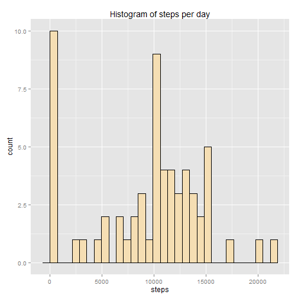
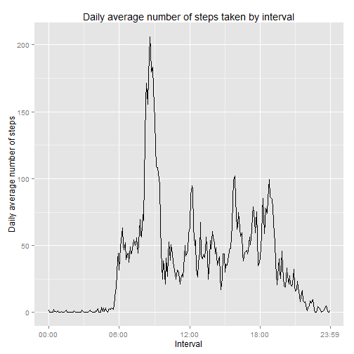

## Loading and preprocessing the data


```r
unzip("activity.zip")
activity <- read.csv("activity.csv")
```

### Looking at the features of the dataset 


```r
head(activity, 10)
```

```
##    steps       date interval
## 1     NA 2012-10-01        0
## 2     NA 2012-10-01        5
## 3     NA 2012-10-01       10
## 4     NA 2012-10-01       15
## 5     NA 2012-10-01       20
## 6     NA 2012-10-01       25
## 7     NA 2012-10-01       30
## 8     NA 2012-10-01       35
## 9     NA 2012-10-01       40
## 10    NA 2012-10-01       45
```

```r
summary(activity)
```

```
##      steps                date          interval     
##  Min.   :  0.00   2012-10-01:  288   Min.   :   0.0  
##  1st Qu.:  0.00   2012-10-02:  288   1st Qu.: 588.8  
##  Median :  0.00   2012-10-03:  288   Median :1177.5  
##  Mean   : 37.38   2012-10-04:  288   Mean   :1177.5  
##  3rd Qu.: 12.00   2012-10-05:  288   3rd Qu.:1766.2  
##  Max.   :806.00   2012-10-06:  288   Max.   :2355.0  
##  NA's   :2304     (Other)   :15840
```

```r
str(activity)
```

```
## 'data.frame':	17568 obs. of  3 variables:
##  $ steps   : int  NA NA NA NA NA NA NA NA NA NA ...
##  $ date    : Factor w/ 61 levels "2012-10-01","2012-10-02",..: 1 1 1 1 1 1 1 1 1 1 ...
##  $ interval: int  0 5 10 15 20 25 30 35 40 45 ...
```

The time intervals in the dataset are not very good for a time series plot, so we need to improve the representation of this information.

### Represent the interval as a string of format `"hh:mm"`. 

To do that, apply integer division to extract the hour part, and mod to extract the minutes part. If the hour/minutes part is less than 10 (e.g. it's 0, 1, 5, etc), add a zero before to normalize the format. Save the result in a new column of the dataset.

For more references about the operators for integer division and mod:

1. https://stat.ethz.ch/R-manual/R-devel/library/base/html/Arithmetic.html

2. https://en.wikipedia.org/wiki/Modulo_operation


```r
activity$time <- 
    paste0(
        as.character(ifelse(activity$interval %/% 100 < 10, 
                            paste0("0", activity$interval %/% 100),
                            activity$interval %/% 100)), 
        ":", 
        as.character(ifelse(activity$interval %% 100 < 10, 
                            paste0("0", activity$interval %% 100),
                            activity$interval %% 100)))
```


## What is mean total number of steps taken per day?

### Summarize by date

Group the data by date and compute the sum of steps taken per day. For this computation, NAs were removed. 

Columns `interval` and `time` are not relevant for this summary, so we use the special `summarise_each_()` function to exclude it.


```r
library(dplyr)
groupByDay <- group_by(activity, date) 
stepsPerDay <- 
    summarise_each_(groupByDay, 
                    funs(sum(., na.rm = TRUE)), 
                    list(quote(-interval),
                         quote(-time)))
```


### Histogram of steps per day


```r
library(ggplot2)
qplot(steps, data = stepsPerDay,
      main = "Histogram of steps per day",
      fill = I("wheat"),
      col = I("black"))
```

```
## stat_bin: binwidth defaulted to range/30. Use 'binwidth = x' to adjust this.
```

 


### Mean and median of steps per day


```r
meanStepsPerDay <- mean(stepsPerDay$steps)
medianStepsPerDay <- median(stepsPerDay$steps)
```

Of the total number of steps taken per day, the mean is 9354.2295082 and the median is 10395.


## What is the average daily activity pattern?

### Compute the average by interval

Group the data by time and interval and compute the mean of steps. As the two columns have the same info with and without format, the `group_by()` result is not affected by the presence of them at the same time. For this computation, `NA`s were removed.

Column `date` is  not relevant for this summary, so we use the special `summarise_each_()` function to exclude it.


```r
groupByInterval <- group_by(activity, time, interval)
meanByInterval <- 
    summarise_each_(groupByInterval, 
                    funs(mean(., na.rm = TRUE)), 
                    list(quote(-date)))
names(meanByInterval)[3] <- "meanSteps"
```


### Time series plot

For this plot we take the time intervals in the x axis, and we apply the functions `period_to_seconds()` and `hm()` from the `lubridate` package in order to make a real time series plot. If the column `interval` was used, the plot will appear with gaps because it's not a real continous series. Instead, the number of seconds from the midnight is used on the x axis.

Due to plot reasons, we use `scale_x_continuous()` to label the x ticks appropriately, breaking the values every 6 hours. The special case is the tick at `23:59`, but it's only cosmetic because there is no data for that exact time. Note that the breaks are expressed in number of seconds from the midnight, as described before.


```r
library(lubridate)
qplot(period_to_seconds(hm(time)), meanSteps, 
      data = meanByInterval, 
      geom = "line",
      main = "Daily average number of steps taken by interval",
      xlab = "Interval",
      ylab = "Daily average number of steps") + 
    scale_x_continuous(
        breaks = c(0, 21600, 43200, 64800, 86340), 
        labels = c("00:00", "06:00", "12:00", "18:00", "23:59"))
```

 


### Maximum number of steps from the daily average


```r
maxStepsDailyAverage <- meanByInterval[which.max(meanByInterval$meanSteps), 1]
```

On average across all the days in the dataset, the interval 08:35 contains the maximum number of steps.


## Imputing missing values

### Compute the `NA`s


```r
stepsNA <- sum(is.na(activity$steps))
```

The total number of missing values in the dataset is 2304.


### Fill in missing values

To fill in `NA`s, the strategy used is to replace them with the average steps for the given interval.


```r
activityComplete <- activity
indexNA <- which(is.na(activityComplete$steps))
for (i in indexNA) {
    activityComplete[i, 1] <- 
        meanByInterval[
            (activityComplete[i, 3] == meanByInterval$interval), 2][[1]]
}
```


## Are there differences in activity patterns between weekdays and weekends?
